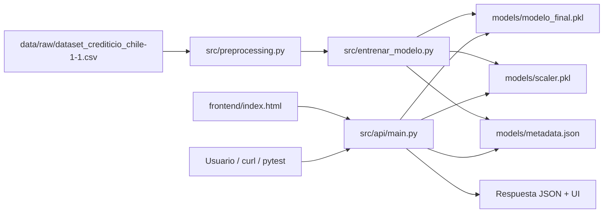

# Arquitectura de despliegue local — Tarea 2

## Objetivo

Exponer el modelo de riesgo crediticio en **localhost** mediante una arquitectura desacoplada que separa entrenamiento, persistencia de artefactos, API y front-end.

## Diagrama de componentes



## Flujo de ejecución

1. **Entrenamiento offline**
   - Limpieza e imputación contextual.
   - Eliminación de `ScoreRiesgo` (data leakage).
   - One-Hot Encoding + `StandardScaler` ajustado solo en train.
   - Comparación de 5 modelos y selección por F1 en test.
   - Exportación de artefactos serializados.

2. **Servicio API (FastAPI)**
   - Carga lazy de modelo, scaler y metadata.
   - Validación de entrada con Pydantic.
   - Endpoint `/predict` transforma datos crudos → vector escalado → probabilidad.
   - Middleware de latencia (`X-Process-Time-Ms`).

3. **Front-end**
   - Formulario HTML/JS servido desde la misma API.
   - Consume `/health` y `/predict`.
   - Muestra etiqueta, probabilidad, latencia e interpretabilidad.

## Endpoints

| Método | Ruta | Propósito |
|--------|------|-----------|
| GET | `/` | Interfaz web |
| GET | `/health` | Estado del servicio |
| GET | `/model/info` | Métricas, CV, calidad e importancias |
| POST | `/predict` | Inferencia individual |
| GET | `/docs` | Documentación Swagger |

## Evaluación técnica del despliegue

| Aspecto | Implementación |
|---------|----------------|
| Tiempo de respuesta | Header `X-Process-Time-Ms` + campo `latencia_ms` |
| Manejo de errores | HTTP 422 validación, 503 sin artefactos, 500 errores internos |
| Estabilidad | Artefactos versionados en `models/` + health check |
| Seguridad básica | Validaciones de rangos, CORS local, sin secretos en repo |
| Modularidad | `preprocessing`, `entrenar_modelo`, `api`, `frontend` separados |

## Evidencia de funcionamiento

Tras levantar la API:

```bash
uvicorn src.api.main:app --host 127.0.0.1 --port 8000
curl http://127.0.0.1:8000/health
curl http://127.0.0.1:8000/model/info
curl -X POST http://127.0.0.1:8000/predict -H "Content-Type: application/json" -d @docs/ejemplo_cliente.json
```

Resultados esperados: JSON con `status: ok`, métricas del modelo y predicción con probabilidad.

## Relación con retroalimentación Sumativa 1

- Mayor detalle de calidad de datos y outliers en `metadata.json`.
- Comparación entre modelos con tiempos y folds de CV en `/model/info`.
- Interpretabilidad visible en API y UI.
- Menor dependencia del notebook para producción académica local.